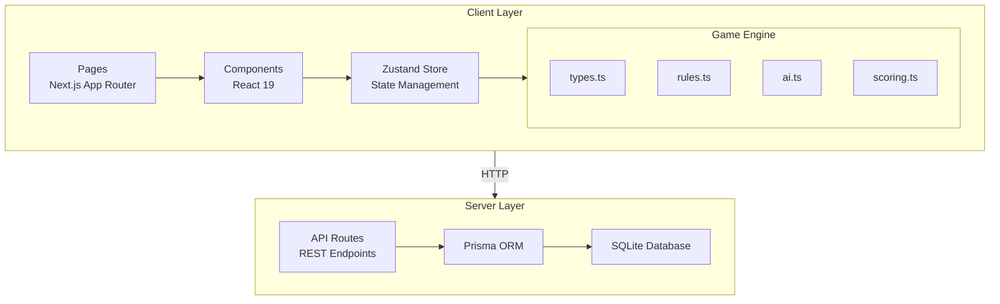

<p align="center">
  
</p>

<h1 align="center">♠️ Spades</h1>

<p align="center">
  <strong>A modern, browser-based implementation of the classic Spades card game</strong>
</p>

<p align="center">
  <a href="#features">Features</a> •
  <a href="#quick-start">Quick Start</a> •
  <a href="#gameplay">Gameplay</a> •
  <a href="#documentation">Documentation</a> •
  <a href="#architecture">Architecture</a> •
  <a href="#contributing">Contributing</a>
</p>

<p align="center">
  
  
  
  
</p>

<p align="center">
  
  
  
  
  
  
</p>

---

## Overview

Spades is a fully-featured implementation of the classic trick-taking card game, built with modern web technologies. Play against intelligent AI opponents across three difficulty levels, track your statistics, and enjoy beautiful animations powered by Framer Motion.

**Why Spades?**

- **Complete Game Engine**: Full Spades ruleset including Nil bids, Blind Nil, bags, and standard scoring
- **Smart AI Opponents**: Three difficulty levels with distinct playing strategies
- **Modern UI/UX**: Responsive design with smooth animations and intuitive controls
- **Persistent Progress**: Game history, statistics, and settings saved automatically
- **Production Ready**: Security headers, rate limiting, input validation, and structured logging

## Screenshots

<p align="center">
  
  <br />
  <em>Main menu with elegant dark green and gold theme</em>
</p>

<p align="center">
  
  <br />
  <em>In-game view showing card play and scoring</em>
</p>

---

## Features

### Core Gameplay
- Standard 4-player Spades with partnership mechanics
- Full bidding system (1-13, Nil, Blind Nil)
- Trump suit mechanics (spades always trump)
- Bag counting and penalty system
- First to 500 points wins

### AI System
| Difficulty | Bidding | Play Style | Thinking Time |
|------------|---------|------------|---------------|
| **Easy** | Random ±1 | 70% random, basic rules | 500-1000ms |
| **Medium** | Conservative | Strategic, wins tricks | 800-1500ms |
| **Hard** | Card counting | Partnership, avoids bags | 1000-2000ms |

### User Experience
- Animated card dealing and play
- Interactive bidding with hint system
- Real-time score tracking
- Round-by-round summaries
- Game history and statistics

### Technical Features
- Server-side rendering with Next.js App Router
- Type-safe codebase with TypeScript
- SQLite database with Prisma ORM
- Rate-limited API endpoints
- Security headers via middleware

---

## Quick Start

### Prerequisites

- **Node.js** 20.0 or higher
- **npm** 10.0 or higher

### Installation

```bash
# Clone the repository
git clone https://github.com/yourusername/spades.git
cd spades

# Install dependencies
npm install

# Initialize the database
npx prisma generate
npx prisma migrate dev

# Start development server
npm run dev
```

Open [http://localhost:3000](http://localhost:3000) to play!

### Production Build

```bash
# Build for production
npm run build

# Start production server
npm start
```

---

## Gameplay

### Game Rules

**Objective**: Be the first team to reach 500 points.

**Teams**:
- You (South) + Partner (North)
- Opponents: West + East

**Round Structure**:
1. **Dealing**: Each player receives 13 cards
2. **Bidding**: Players bid how many tricks they expect to win
3. **Playing**: 13 tricks are played following suit rules
4. **Scoring**: Points awarded based on bid success

### Scoring

| Scenario | Points |
|----------|--------|
| Made bid | +10 per trick bid |
| Overtricks (bags) | +1 each |
| Set (missed bid) | -10 per trick bid |
| Nil success | +100 |
| Nil failure | -100 |
| Blind Nil success | +200 |
| Blind Nil failure | -200 |
| 10 bags penalty | -100 |

### Controls

| Action | Control |
|--------|---------|
| Select card | Click on card |
| Place bid | Click bid number |
| Get hint | Click hint button |
| New game | Menu → New Game |

---

## Documentation

Comprehensive documentation is available in the `/doc` folder:

| Document | Description |
|----------|-------------|
| [ARCHITECTURE.md](doc/ARCHITECTURE.md) | System architecture and design patterns |
| [GAME_ENGINE.md](doc/GAME_ENGINE.md) | Game logic, rules, AI, and scoring |
| [STATE_MANAGEMENT.md](doc/STATE_MANAGEMENT.md) | Zustand store and state flow |
| [API_REFERENCE.md](doc/API_REFERENCE.md) | REST API endpoints and schemas |
| [DATABASE.md](doc/DATABASE.md) | Prisma schema and data models |
| [COMPONENTS.md](doc/COMPONENTS.md) | React component documentation |
| [SECURITY.md](doc/SECURITY.md) | Security measures and best practices |
| [DEPLOYMENT.md](doc/DEPLOYMENT.md) | Deployment guide for various platforms |
| [TROUBLESHOOTING.md](doc/TROUBLESHOOTING.md) | Common issues and solutions |
| [GLOSSARY.md](doc/GLOSSARY.md) | Terms and definitions |
| [CHANGELOG.md](doc/CHANGELOG.md) | Version history |

---

## Architecture



### Project Structure

```
spades/
├── doc/                    # Documentation
├── prisma/                 # Database schema & migrations
├── public/                 # Static assets
│   └── imgs/              # Card SVG images
├── src/
│   ├── app/               # Next.js App Router
│   │   ├── api/          # API routes
│   │   ├── game/         # Game page
│   │   ├── settings/     # Settings page
│   │   ├── tutorial/     # Tutorial page
│   │   └── history/      # History page
│   ├── components/        # React components
│   │   ├── game/         # Game-specific
│   │   ├── svg/          # SVG graphics
│   │   └── ui/           # UI primitives
│   ├── hooks/            # Custom React hooks
│   └── lib/              # Core libraries
│       ├── game/         # Game engine
│       ├── store.ts      # State management
│       ├── db.ts         # Database client
│       ├── logger.ts     # Logging utility
│       ├── rateLimit.ts  # Rate limiting
│       └── validation.ts # Input validation
└── package.json
```

---

## Technology Stack

| Category | Technology | Version |
|----------|------------|---------|
| **Framework** | Next.js | 16.0.4 |
| **UI Library** | React | 19.2.0 |
| **Language** | TypeScript | 5.x |
| **Styling** | Tailwind CSS | 4.x |
| **Animations** | Framer Motion | 12.x |
| **3D Graphics** | Three.js / R3F | 0.181.x |
| **State** | Zustand | 5.x |
| **Database** | SQLite | - |
| **ORM** | Prisma | 6.8.x |

---

## Development

### Available Scripts

```bash
# Development server with Turbopack
npm run dev

# Production build
npm run build

# Start production server
npm start

# Run linter
npm run lint

# Database operations
npx prisma studio     # GUI for database
npx prisma migrate dev # Create migration
npx prisma generate   # Generate client
```

### Environment Variables

Create a `.env` file:

```env
DATABASE_URL="file:./spades.db"
LOG_LEVEL="debug"
LOG_FORMAT="text"
```

### Code Quality

The project follows:
- Google TypeScript Style Guide
- DRY (Don't Repeat Yourself) principles
- Clean code practices
- Comprehensive inline documentation

---

## API Endpoints

| Endpoint | Methods | Description |
|----------|---------|-------------|
| `/api/game` | GET, POST, PUT | Game management |
| `/api/settings` | GET, POST | User settings |
| `/api/stats` | GET, POST | Player statistics |

All endpoints are rate-limited to 60 requests per minute.

See [API_REFERENCE.md](doc/API_REFERENCE.md) for complete documentation.

---

## Contributing

Contributions are welcome! Please see [CONTRIBUTING.md](CONTRIBUTING.md) for detailed guidelines.

**Quick Start:**
1. Fork the repository
2. Create a feature branch (`git checkout -b feature/amazing-feature`)
3. Make your changes following our code standards
4. Commit with conventional commit messages
5. Push and open a Pull Request

**Code Standards:**
- TypeScript with full type annotations
- JSDoc comments for public functions
- Follow existing code style and patterns
- Test your changes thoroughly

See [CONTRIBUTING.md](CONTRIBUTING.md) for complete guidelines.

---

## License

This project is licensed under the Apache License 2.0 - see the [LICENSE](LICENSE) file for details.

**What this means:**
- ✅ Free to use for any purpose (commercial or personal)
- ✅ Free to modify and distribute
- ✅ Free to create derivative works
- ✅ Patent grant included
- 📝 Must include license and copyright notice
- 📝 Must state changes if you modify files

This is a permissive open-source license that allows maximum freedom while protecting contributors.

---

## Acknowledgments
- Written by Dustin T Hughes with aid from the latest ai coding agents. 
- Card SVG designs from [deck.of" cards](https://deck.of.cards)
- Game rules based on [Bicycle Cards Official Rules](https://bicyclecards.com/how-to-play/spades)
- Built with [Next.js](https://nextjs.org), [React](https://react.dev), and [Prisma](https://prisma.io)

---

<p align="center">
  Made with ♠️ by passionate card game enthusiasts
</p>
