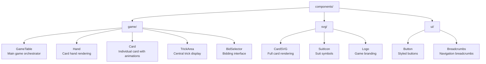
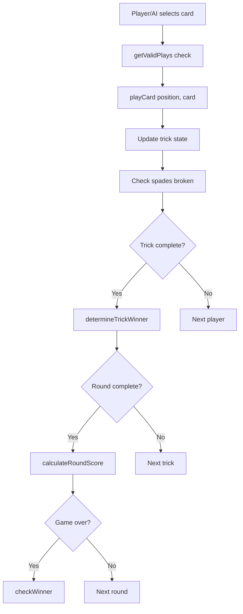
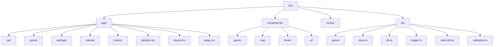

# Spades Game Architecture

## Overview

The Spades card game is a modern, full-stack web application built with Next.js 16, React 19, and TypeScript. The architecture follows a clean separation of concerns with distinct layers for game logic, state management, UI components, and data persistence.

## System Architecture

```mermaid
graph TB
    subgraph Client["Client Layer"]
        subgraph React["React Components"]
            GameTable[GameTable]
            Hand[Hand]
            Card[Card]
            SVG[SVG Components]
        end
        
        Zustand[Zustand Store<br/>Global State Management]
        
        subgraph Engine["Game Engine"]
            Rules[Rules]
            AI[AI]
            Scoring[Scoring]
            Deck[Deck]
        end
        
        React --> Zustand
        Zustand --> Engine
    end
    
    subgraph Server["Server Layer"]
        subgraph API["API Routes"]
            GameAPI[/game]
            SettingsAPI[/settings]
            StatsAPI[/stats]
        end
        
        Prisma[Prisma ORM]
        
        subgraph DB["SQLite Database"]
            GameModel[Game]
            RoundModel[Round]
            SettingsModel[Settings]
            StatsModel[Stats]
        end
        
        API --> Prisma
        Prisma --> DB
    end
    
    Client -->|HTTP| Server
```

## Core Components

### 1. Game Engine (`src/lib/game/`)

The game engine contains all the business logic for the Spades card game:

| Module | Responsibility |
|--------|---------------|
| `types.ts` | TypeScript interfaces, constants, and utility functions |
| `rules.ts` | Game rules enforcement (trick determination, valid plays) |
| `scoring.ts` | Score calculation, nil handling, bag penalties |
| `ai.ts` | Multi-difficulty AI opponent logic |
| `deck.ts` | Deck creation, shuffling, and dealing |

### 2. State Management (`src/lib/store.ts`)

Uses Zustand for lightweight, performant global state management:

- **Game State**: Phase, players, tricks, scores
- **Actions**: Start game, play card, place bid
- **Derived State**: Valid plays, current player

### 3. UI Layer (`src/components/`)

Component hierarchy:



### 4. API Layer (`src/app/api/`)

RESTful API endpoints:

| Endpoint | Methods | Purpose |
|----------|---------|---------|
| `/api/game` | GET, POST, PUT | Game CRUD operations |
| `/api/settings` | GET, POST | User settings persistence |
| `/api/stats` | GET, POST | Player statistics |

### 5. Security Layer

- **Middleware**: Security headers (CSP, XSS protection)
- **Rate Limiting**: In-memory request throttling
- **Validation**: Input sanitization utilities

## Data Flow

### Game Initialization

```mermaid
flowchart TD
    Start[User clicks "New Game"] --> StartGame[startNewGame difficulty]
    StartGame --> CreateState[Create initial state]
    CreateState --> Deal[dealCards<br/>Fisher-Yates shuffle]
    Deal --> PhaseBidding[Phase: "bidding"]
    PhaseBidding --> Bidding[AI/Player bidding sequence]
    Bidding --> PhasePlaying[Phase: "playing"]
```

### Card Play Flow



## Technology Stack

| Layer | Technology |
|-------|------------|
| Framework | Next.js 16 (App Router) |
| UI Library | React 19 |
| Language | TypeScript 5 |
| State | Zustand 5 |
| Animations | Framer Motion 12 |
| 3D Graphics | Three.js / React Three Fiber |
| Styling | Tailwind CSS 4 |
| Database | SQLite via Prisma 6 |
| Runtime | Node.js 20+ |

## Design Principles

### 1. Separation of Concerns
- Game logic is completely isolated from UI
- State management is centralized and predictable
- API routes handle only data operations

### 2. Type Safety
- Full TypeScript coverage
- Strict type checking enabled
- No use of `any` types

### 3. Performance
- Memoized components with `memo()`
- Efficient re-renders via Zustand selectors
- Animation optimization with Framer Motion

### 4. Security
- Input validation on all API endpoints
- Rate limiting to prevent abuse
- Security headers via middleware

## File Organization



## Extensibility

The architecture supports easy extension:

- **New AI Difficulties**: Add to `Difficulty` type and `ai.ts`
- **Alternative Rulesets**: Extend `rules.ts`
- **New UI Themes**: Modify CSS variables
- **Additional Persistence**: Add Prisma models

---

*Architecture Version: 1.0.0*
*Last Updated: November 2024*

