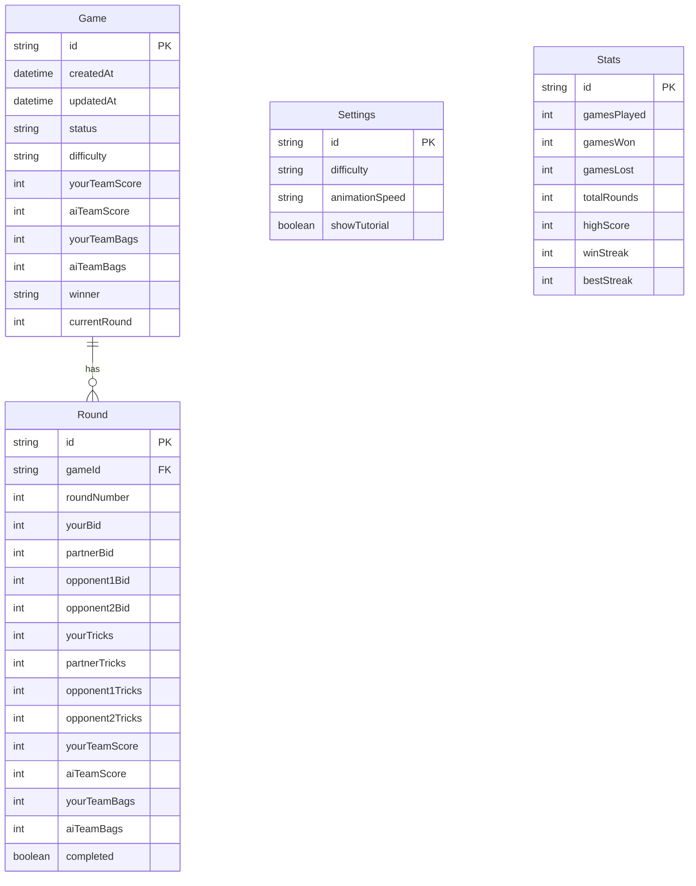

# Database Schema Documentation

## Overview

The Spades application uses SQLite as its database, managed through Prisma ORM. The schema supports game persistence, user settings, and player statistics.

## Technology Stack

| Component | Technology |
|-----------|------------|
| Database | SQLite |
| ORM | Prisma 6.x |
| Location | `prisma/spades.db` |
| Schema | `prisma/schema.prisma` |

---

## Schema Diagram



---

## Models

### Game Model

Represents a complete game session.

```prisma
model Game {
  id            String   @id @default(cuid())
  createdAt     DateTime @default(now())
  updatedAt     DateTime @updatedAt
  status        String   @default("in_progress")
  difficulty    String   @default("medium")
  yourTeamScore Int      @default(0)
  aiTeamScore   Int      @default(0)
  yourTeamBags  Int      @default(0)
  aiTeamBags    Int      @default(0)
  winner        String?
  currentRound  Int      @default(1)
  rounds        Round[]
}
```

| Field | Type | Default | Description |
|-------|------|---------|-------------|
| `id` | String | CUID | Unique identifier |
| `createdAt` | DateTime | now() | Creation timestamp |
| `updatedAt` | DateTime | auto | Last modification |
| `status` | String | "in_progress" | Game status |
| `difficulty` | String | "medium" | AI difficulty |
| `yourTeamScore` | Int | 0 | Player team score |
| `aiTeamScore` | Int | 0 | AI team score |
| `yourTeamBags` | Int | 0 | Player team bags |
| `aiTeamBags` | Int | 0 | AI team bags |
| `winner` | String? | null | "you" or "ai" |
| `currentRound` | Int | 1 | Current round number |
| `rounds` | Round[] | - | Related rounds |

**Status Values:**
- `"in_progress"` - Game is ongoing
- `"completed"` - Game has ended

**Winner Values:**
- `null` - No winner yet
- `"you"` - Player won
- `"ai"` - AI won

---

### Round Model

Represents a single round within a game.

```prisma
model Round {
  id              String @id @default(cuid())
  gameId          String
  game            Game   @relation(fields: [gameId], references: [id], onDelete: Cascade)
  roundNumber     Int
  
  // Bids (0 = nil, -1 = blind nil)
  yourBid         Int
  partnerBid      Int
  opponent1Bid    Int
  opponent2Bid    Int
  
  // Tricks won
  yourTricks      Int    @default(0)
  partnerTricks   Int    @default(0)
  opponent1Tricks Int    @default(0)
  opponent2Tricks Int    @default(0)
  
  // Scores after this round
  yourTeamScore   Int    @default(0)
  aiTeamScore     Int    @default(0)
  yourTeamBags    Int    @default(0)
  aiTeamBags      Int    @default(0)
  
  completed       Boolean @default(false)

  @@unique([gameId, roundNumber])
}
```

| Field | Type | Default | Description |
|-------|------|---------|-------------|
| `id` | String | CUID | Unique identifier |
| `gameId` | String | - | Parent game FK |
| `roundNumber` | Int | - | Round sequence (1+) |
| `yourBid` | Int | - | Player's bid |
| `partnerBid` | Int | - | Partner's bid |
| `opponent1Bid` | Int | - | West's bid |
| `opponent2Bid` | Int | - | East's bid |
| `yourTricks` | Int | 0 | Player's tricks |
| `partnerTricks` | Int | 0 | Partner's tricks |
| `opponent1Tricks` | Int | 0 | West's tricks |
| `opponent2Tricks` | Int | 0 | East's tricks |
| `yourTeamScore` | Int | 0 | Cumulative score |
| `aiTeamScore` | Int | 0 | AI cumulative score |
| `completed` | Boolean | false | Round completed |

**Bid Values:**
- `0` - Nil bid
- `-1` - Blind Nil bid
- `1-13` - Standard bid

**Constraints:**
- `@@unique([gameId, roundNumber])` - One round per number per game

**Cascade Delete:**
- Deleting a game deletes all its rounds

---

### Settings Model

Global application settings (singleton).

```prisma
model Settings {
  id              String  @id @default("global")
  difficulty      String  @default("medium")
  animationSpeed  String  @default("normal")
  showTutorial    Boolean @default(true)
}
```

| Field | Type | Default | Description |
|-------|------|---------|-------------|
| `id` | String | "global" | Always "global" |
| `difficulty` | String | "medium" | Default difficulty |
| `animationSpeed` | String | "normal" | Animation speed |
| `showTutorial` | Boolean | true | Show tutorial |

**Difficulty Values:**
- `"easy"` - Easier AI opponents
- `"medium"` - Balanced gameplay
- `"hard"` - Expert AI with card counting

**Animation Speed Values:**
- `"slow"` - Slower animations
- `"normal"` - Standard speed
- `"fast"` - Quick animations

---

### Stats Model

Player statistics tracking (singleton).

```prisma
model Stats {
  id          String @id @default("global")
  gamesPlayed Int    @default(0)
  gamesWon    Int    @default(0)
  gamesLost   Int    @default(0)
  totalRounds Int    @default(0)
  highScore   Int    @default(0)
  winStreak   Int    @default(0)
  bestStreak  Int    @default(0)
}
```

| Field | Type | Default | Description |
|-------|------|---------|-------------|
| `id` | String | "global" | Always "global" |
| `gamesPlayed` | Int | 0 | Total completed games |
| `gamesWon` | Int | 0 | Games won by player |
| `gamesLost` | Int | 0 | Games lost to AI |
| `totalRounds` | Int | 0 | Total rounds played |
| `highScore` | Int | 0 | Highest game score |
| `winStreak` | Int | 0 | Current win streak |
| `bestStreak` | Int | 0 | Best streak ever |

---

## Prisma Client

### Configuration

```typescript
// src/lib/db.ts
import { PrismaClient } from "@prisma/client";

const globalForPrisma = globalThis as unknown as {
  prisma: PrismaClient | undefined;
};

export const prisma = globalForPrisma.prisma ?? new PrismaClient();

if (process.env.NODE_ENV !== "production") {
  globalForPrisma.prisma = prisma;
}

export default prisma;
```

**Development Mode:**
- Singleton pattern prevents multiple client instances during hot reload
- Client is cached on `globalThis`

**Production Mode:**
- New client per import (single instance per process)

### Environment Configuration

```env
# .env
DATABASE_URL="file:./spades.db"
```

---

## Common Queries

### Create Game

```typescript
const game = await prisma.game.create({
  data: {
    difficulty: "medium",
    status: "in_progress",
  },
});
```

### Get Recent Games

```typescript
const games = await prisma.game.findMany({
  orderBy: { createdAt: "desc" },
  take: 20,
});
```

### Update Game Score

```typescript
const updated = await prisma.game.update({
  where: { id: gameId },
  data: {
    yourTeamScore: 280,
    aiTeamScore: 150,
    currentRound: 4,
  },
});
```

### Complete Game

```typescript
const completed = await prisma.game.update({
  where: { id: gameId },
  data: {
    status: "completed",
    winner: "you",
    yourTeamScore: 520,
  },
});
```

### Upsert Settings

```typescript
const settings = await prisma.settings.upsert({
  where: { id: "global" },
  update: {
    difficulty: "hard",
    animationSpeed: "fast",
  },
  create: {
    id: "global",
    difficulty: "hard",
    animationSpeed: "fast",
    showTutorial: true,
  },
});
```

### Update Stats After Win

```typescript
await prisma.stats.update({
  where: { id: "global" },
  data: {
    gamesPlayed: { increment: 1 },
    gamesWon: { increment: 1 },
    winStreak: { increment: 1 },
    bestStreak: {
      set: Math.max(currentBestStreak, newWinStreak),
    },
  },
});
```

---

## Migrations

### Generate Migration

```bash
npx prisma migrate dev --name migration_name
```

### Apply Migrations

```bash
npx prisma migrate deploy
```

### Reset Database

```bash
npx prisma migrate reset
```

### View Database

```bash
npx prisma studio
```

---

## Migration History

### `20251126222138_init`

Initial database schema:
- Created `Game` model
- Created `Round` model with game relation
- Created `Settings` singleton model
- Created `Stats` singleton model

---

## Performance Considerations

### Indexes

Primary keys are automatically indexed:
- `Game.id`
- `Round.id`
- `Settings.id`
- `Stats.id`

The unique constraint provides an index:
- `Round.[gameId, roundNumber]`

### Query Optimization

1. **Limit Results**: Always use `take` for lists
2. **Select Fields**: Use `select` for partial data
3. **Avoid N+1**: Use `include` for relations

```typescript
// Good: Limited and ordered
const games = await prisma.game.findMany({
  orderBy: { createdAt: "desc" },
  take: 20,
  select: {
    id: true,
    status: true,
    yourTeamScore: true,
    aiTeamScore: true,
    winner: true,
  },
});

// Good: Include relation
const gameWithRounds = await prisma.game.findUnique({
  where: { id: gameId },
  include: { rounds: true },
});
```

---

## Backup and Restore

### Backup

```bash
cp prisma/spades.db prisma/spades.db.backup
```

### Restore

```bash
cp prisma/spades.db.backup prisma/spades.db
```

### Export to SQL

```bash
sqlite3 prisma/spades.db .dump > backup.sql
```

---

*Database Schema Version: 1.0.0*
*Last Updated: November 2024*

