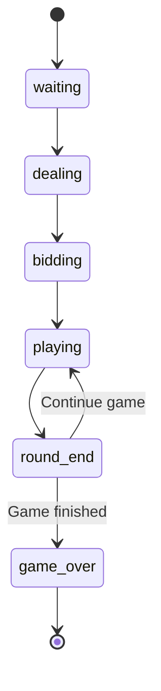

# State Management Documentation

## Overview

The application uses Zustand for state management, providing a lightweight, performant, and type-safe solution for managing game state across React components.

## Store Architecture

### Location

```
src/lib/store.ts
```

### State Structure

```typescript
interface GameState {
  // Game identification
  id: string | null;
  
  // Current game phase
  phase: GamePhase;
  
  // AI difficulty setting
  difficulty: Difficulty;
  
  // All four players
  players: Record<PlayerPosition, Player>;
  
  // Current round state
  round: RoundState;
  
  // Team scores
  playerTeamScore: TeamScore;
  opponentTeamScore: TeamScore;
  
  // Game result
  winner: Team | null;
  
  // Animation lock
  isAnimating: boolean;
}
```

---

## State Slices

### Game Identification

```typescript
{
  id: string | null;  // Unique game ID (UUID v4)
}
```

Generated using `crypto.randomUUID()` when starting a new game.

### Phase Management

```typescript
{
  phase: "waiting" | "dealing" | "bidding" | "playing" | "round_end" | "game_over";
}
```

**Phase Transitions:**



### Player State

```typescript
players: {
  south: Player;  // Human player
  west: Player;   // AI opponent
  north: Player;  // AI partner
  east: Player;   // AI opponent
}
```

Each player contains:
- `hand`: Current cards
- `bid`: Bid for current round
- `tricksWon`: Tricks won this round
- `isHuman`: Player type flag

### Round State

```typescript
interface RoundState {
  roundNumber: number;        // Current round (1+)
  tricks: Trick[];            // Completed tricks
  currentTrick: Trick | null; // Trick in progress
  currentPlayer: PlayerPosition;
  spadesBroken: boolean;      // Whether spades have been played
  bidsComplete: boolean;      // All players have bid
}
```

### Team Scores

```typescript
interface TeamScore {
  score: number;      // Cumulative score
  bags: number;       // Current bag count
  roundScore: number; // Points from last round
  roundBags: number;  // Bags from last round
}
```

---

## Actions

### Game Lifecycle

#### `startNewGame(difficulty: Difficulty)`

Initializes a new game.

```typescript
const startNewGame = useGameStore((s) => s.startNewGame);
startNewGame("medium");
```

**Effects:**
1. Resets all state to initial values
2. Generates new game ID
3. Sets phase to "dealing"
4. Triggers `dealHands()` after 100ms

#### `loadGame(state: Partial<GameState>)`

Loads a saved game state.

```typescript
const loadGame = useGameStore((s) => s.loadGame);
loadGame(savedState);
```

#### `reset()`

Resets to initial waiting state.

```typescript
const reset = useGameStore((s) => s.reset);
reset();
```

### Dealing

#### `dealHands()`

Deals cards to all players.

```typescript
const dealHands = useGameStore((s) => s.dealHands);
dealHands();
```

**Effects:**
1. Creates and shuffles deck
2. Deals 13 cards to each player
3. Sorts hands by suit/rank
4. Resets player bids and tricks
5. Sets phase to "bidding"

### Bidding

#### `placeBid(position: PlayerPosition, bid: number)`

Records a player's bid.

```typescript
const placeBid = useGameStore((s) => s.placeBid);
placeBid("south", 4);
```

**Effects:**
1. Updates player's bid
2. Advances to next player
3. Transitions to "playing" when all bids complete

### Card Play

#### `playCard(position: PlayerPosition, card: Card)`

Plays a card to the current trick.

```typescript
const playCard = useGameStore((s) => s.playCard);
playCard("south", selectedCard);
```

**Effects:**
1. Removes card from player's hand
2. Adds card to current trick
3. Creates new trick if leading
4. Checks if spades broken
5. Advances to next player

#### `finishTrick()`

Completes current trick and awards to winner.

```typescript
const finishTrick = useGameStore((s) => s.finishTrick);
finishTrick();
```

**Effects:**
1. Determines trick winner
2. Increments winner's trick count
3. Adds to completed tricks
4. Sets winner as next leader
5. Triggers `finishRound()` if 13 tricks done

### Round Management

#### `finishRound()`

Calculates scores for completed round.

```typescript
const finishRound = useGameStore((s) => s.finishRound);
finishRound();
```

**Effects:**
1. Calculates both teams' scores
2. Updates team score totals
3. Checks for game winner
4. Sets phase to "round_end" or "game_over"

#### `nextRound()`

Starts a new round.

```typescript
const nextRound = useGameStore((s) => s.nextRound);
nextRound();
```

**Effects:**
1. Increments round number
2. Resets trick/spades state
3. Triggers new deal

### AI Processing

#### `processAITurn(): Promise<void>`

Executes AI player's turn.

```typescript
const processAITurn = useGameStore((s) => s.processAITurn);
await processAITurn();
```

**Effects:**
1. Adds thinking delay (difficulty-based)
2. Calculates AI bid or card selection
3. Executes `placeBid()` or `playCard()`
4. Triggers `finishTrick()` if trick complete

### Animation Control

#### `setAnimating(isAnimating: boolean)`

Sets animation lock state.

```typescript
const setAnimating = useGameStore((s) => s.setAnimating);
setAnimating(true);
// ... animation ...
setAnimating(false);
```

### Derived State

#### `getValidPlaysForPlayer(position: PlayerPosition): Card[]`

Gets valid cards for a player to play.

```typescript
const validPlays = useGameStore.getState().getValidPlaysForPlayer("south");
```

---

## Usage Patterns

### Subscribing to State

```typescript
// Subscribe to single value
const phase = useGameStore((s) => s.phase);

// Subscribe to nested value
const currentPlayer = useGameStore((s) => s.round.currentPlayer);

// Subscribe to multiple values
const { phase, round } = useGameStore((s) => ({
  phase: s.phase,
  round: s.round,
}));
```

### Getting State Outside React

```typescript
// Direct state access
const state = useGameStore.getState();

// Call actions directly
useGameStore.getState().playCard("south", card);
```

### Optimized Subscriptions

```typescript
// Use selectors for performance
const isMyTurn = useGameStore((s) => 
  s.round.currentPlayer === "south" && s.phase === "playing"
);

// Memoized complex selectors
const validPlays = useMemo(() => {
  return getValidPlays(hand, currentTrick, spadesBroken, isLeading);
}, [hand, currentTrick, spadesBroken, isLeading]);
```

---

## State Flow Diagrams

### Bidding Flow

```mermaid
flowchart TD
    PlaceBid[placeBid "west", 3] --> UpdateBid[Update west.bid = 3]
    UpdateBid --> CheckComplete{All bids complete?}
    CheckComplete -->|No| NextBidder[currentPlayer = "north"]
    CheckComplete -->|Yes| SetPhase[phase = "playing"]
    SetPhase --> SetCurrentPlayer[currentPlayer = "west"<br/>left of dealer]
```

### Trick Flow

```mermaid
flowchart TD
    PlayCard[playCard "south", card] --> RemoveCard[Remove card from hand]
    RemoveCard --> AddTrick[Add to currentTrick]
    AddTrick --> TrickComplete{Trick complete?}
    TrickComplete -->|No| NextPlayer[currentPlayer = next]
    TrickComplete -->|Yes| FinishTrick[finishTrick]
    FinishTrick --> DetermineWinner[Determine winner]
    DetermineWinner --> RoundComplete{Round complete?}
    RoundComplete -->|No| SetWinner[currentPlayer = winner]
    RoundComplete -->|Yes| FinishRound[finishRound]
    FinishRound --> GameWon{Game won?}
    GameWon -->|No| RoundEnd[phase = "round_end"]
    GameWon -->|Yes| GameOver[phase = "game_over"]
```

---

## Persistence

### Saving Game State

```typescript
// Serialize current state
const state = useGameStore.getState();
const serialized = JSON.stringify({
  id: state.id,
  difficulty: state.difficulty,
  players: state.players,
  round: state.round,
  playerTeamScore: state.playerTeamScore,
  opponentTeamScore: state.opponentTeamScore,
  phase: state.phase,
});

// Save to database via API
await fetch('/api/game', {
  method: 'PUT',
  body: serialized,
});
```

### Loading Game State

```typescript
// Fetch from database
const response = await fetch('/api/game/' + gameId);
const savedState = await response.json();

// Restore to store
useGameStore.getState().loadGame(savedState);
```

---

## Best Practices

### 1. Use Selectors

```typescript
// Good: Minimal subscription
const phase = useGameStore((s) => s.phase);

// Bad: Subscribe to everything
const state = useGameStore();
```

### 2. Avoid Stale Closures

```typescript
// Good: Get fresh state
const handleClick = () => {
  const state = useGameStore.getState();
  // use state...
};

// Bad: Stale reference
const state = useGameStore.getState();
const handleClick = () => {
  // state might be stale...
};
```

### 3. Atomic Updates

```typescript
// Good: Single update
set((state) => ({
  ...state,
  players: { ...state.players, [position]: updatedPlayer },
  round: { ...state.round, currentPlayer: next },
}));

// Bad: Multiple updates
set((state) => ({ ...state, players: newPlayers }));
set((state) => ({ ...state, round: newRound }));
```

### 4. Immutable Updates

```typescript
// Good: Spread operator
const newHand = player.hand.filter((c) => c.id !== card.id);

// Bad: Mutation
player.hand.splice(index, 1);
```

---

*Documentation Version: 1.0.0*
*Last Updated: November 2024*

